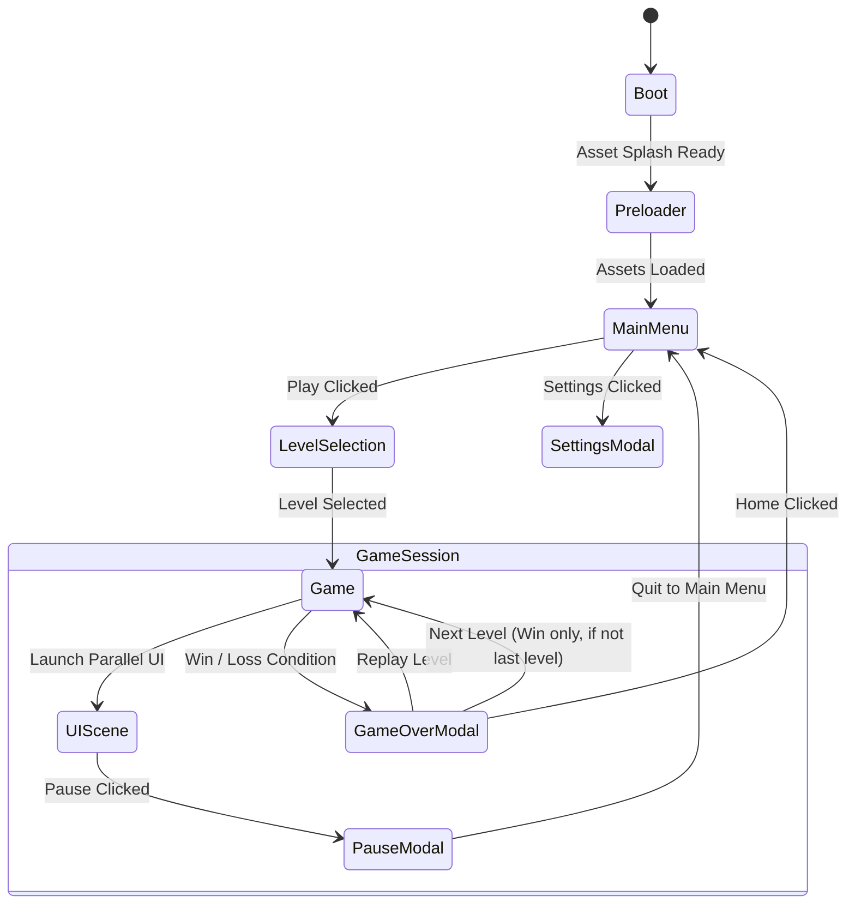

# Scenes & Flow Architecture

This reference defines the lifecycle, states, and scene flow transitions for the Phaser project.

---

## 🎮 Scene Registry & Responsibilities

| Scene Key | Class | Role / Purpose | Type |
| :--- | :--- | :--- | :--- |
| `Boot` | `Boot.ts` | Loads initial minimal splash/loading assets, triggers `Preloader`. | Startup |
| `Preloader` | `Preloader.ts` | Loads all global UI, audio, textures, fonts, and displays loading bar. | Loader |
| `MainMenu` | `MainMenu.ts` | Primary landing screen, starts BGM, navigates to Level Selection / Settings. | Menu |
| `LevelSelection` | `LevelSelection.ts` | Displays unlocked/locked levels grid, starts chosen level. | Navigation |
| `Game` | `Game.ts` | Active gameplay controller (spawns features, handles win/lose/pause). | Gameplay |
| `UIScene` | `UIScene.ts` | Overlay HUD scene running parallel to `Game` (Score, Timer, Pause trigger). | Parallel Overlay |
| `GlobalUI` | `GlobalUI.ts` | Global UI notifications, alerts, or persistent top-level controls. | Global Overlay |

---

## 🔄 Scene Lifecycle & Flow



---

## 🏆 Game Over & Game Completed Dialog Actions & Button Layout

Modals displayed on level end (`GameOverPanel`) must strictly adhere to the following button action and layout rules:

### 1. Button Functionality
- **Replay / Retry (`retry_icon`)**:
  - **Action**: Restarts the current level immediately.
- **Home (`home_icon`)**:
  - **Action**: Navigates back to `MainMenu`.
- **Next (`next_icon`)**:
  - **Action**: Navigates to the next level.
    - If the project uses a single modular game scene (e.g. `Game.ts` receiving `{ level: currentLevel + 1 }`), restart/launch with updated data.
    - If the project uses dedicated level scenes (e.g. `Level2Scene`), start the specific next level scene.

### 2. Button Visibility & Dynamic Layout Spacing
- **Intermediate Levels (Win State)**:
  - Displays **3 buttons**: `Replay` (left), `Home` (center), and `Next` (right).
  - Centered with standard 3-button spacing.
- **Last / Final Level (Win State)**:
  - **Next button MUST NOT be visible**.
  - Displays **2 buttons**: `Replay` and `Home`.
  - Buttons MUST automatically reposition to maintain **equal symmetric spacing** around the center.
- **Game Over / Fail State**:
  - Displays **2 buttons**: `Retry` and `Home`.
  - Symmetrically spaced around center.

---

## 🔀 Scene Launching & Switching Conventions

1. **Sequential Scenes (Clean Switch)**:
   ```typescript
   this.scene.start('LevelSelection'); // Shuts down current scene and starts target
   ```

2. **Parallel HUD / Overlay Scenes**:
   ```typescript
   // Inside Game.ts create()
   this.scene.launch('UIScene', { levelId: this.currentLevel });
   ```

3. **Passing Scene Data**:
   ```typescript
   // Sending
   this.scene.start('Game', { levelId: 1, difficulty: 'normal' });

   // Receiving (Inside target scene init())
   init(data: { levelId: number; difficulty: string }) {
       this.currentLevel = data.levelId;
   }
   ```

4. **Pausing and Resuming Gameplay**:
   ```typescript
   this.scene.pause('Game');
   // Resume
   this.scene.resume('Game');
   ```

---

## ⚠️ Scene Rules & Best Practices
- **Never instantiate gameplay entities directly in `Game.ts` without feature controllers**: Delegate to `src/game/features/`.
- **Parallel UI Scenes Cleanup**: When restarting or switching scenes from a parallel UI setup (`Game` + `UIScene`), always stop `UIScene` (`this.scene.stop('UIScene')`) to ensure its event listeners and HUD elements are completely recreated fresh for the next level.
- **Always reset level and score state in `init()`**: Reset scores, completion flags, and feature controllers on scene start/restart.
- **Always clean up timers and event listeners in `shutdown`**:
  ```typescript
  shutdown() {
      this.events.off('update-score');
  }
  ```
