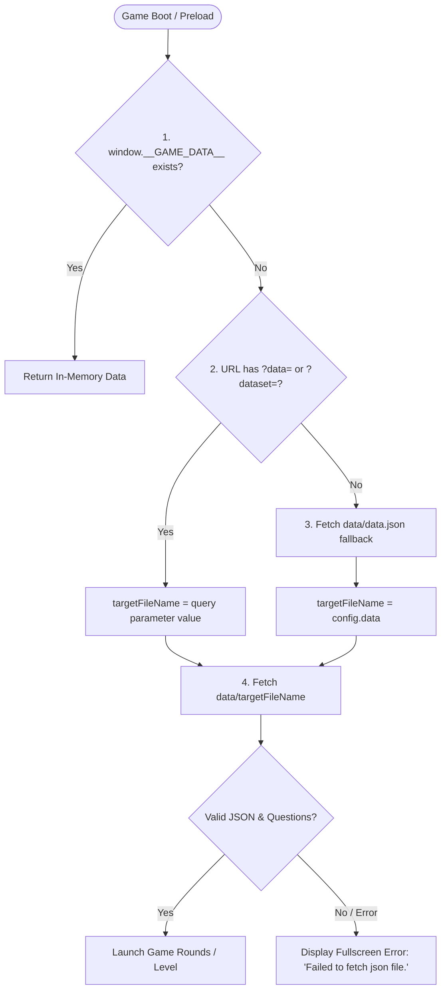

# 🎮 Game-Side Integration Guide

This guide details the complete game-side architecture, data loading algorithm, and Flutter communication standards. Any web game (Phaser 3, React, PixiJS, Vue, Vanilla Canvas) in this project ecosystem can follow this standard to support:

1. **Dynamic Dataset Loading (Single build for multiple subjects/levels)**
2. **Flutter Communication Bridge (Outgoing completion events & incoming commands)**
3. **Graceful Error Handling & Fallbacks**

> 📱 **Looking for Flutter Implementation?** See [FLUTTER_INTEGRATION_GUIDE.md](file:///d:/CV-Phaser/Save%20the%20children/STC-Grade3-Majong-Revamp/FLUTTER_INTEGRATION_GUIDE.md) for configuring `WebViewController`, `JavaScriptChannel`, and handling events in Dart.

---

## 📁 Standard Directory Structure

```text
public/
└── data/
    ├── data.json                   <-- Fallback pointer (used if no URL param is given)
    ├── grade3_math_nepali.json     <-- Question Dataset 1
    ├── grade3_math_english.json    <-- Question Dataset 2
    ├── grade3_science_nepali.json  <-- Question Dataset 3
    └── ...                         <-- Up to 9+ question datasets
src/
└── utils/
    ├── dataLoader.js               <-- Universal dataset loader algorithm
    └── flutterBridge.js            <-- Bidirectional communication bridge
```

---

## 🔄 Algorithm 1: Dynamic Data Resolution & Loading

The game resolves which question dataset to load using a 3-tier priority fallback:



### Complete Implementation (`src/utils/dataLoader.js`)

Copy this module directly into any game project:

```javascript
/**
 * Universal Game Level Loader
 * 
 * Priority:
 * 1. window.__GAME_DATA__ (Direct Flutter memory injection)
 * 2. URL search param ?data=filename.json (Flutter WebView query param)
 * 3. data/data.json (Default fallback config file)
 */
export async function loadGameLevels() {
  // 1. Direct in-memory injection from Flutter or container
  if (
    typeof window !== 'undefined' &&
    window.__GAME_DATA__ &&
    Array.isArray(window.__GAME_DATA__) &&
    window.__GAME_DATA__.length > 0
  ) {
    console.log('[DataLoader] Loaded levels from window.__GAME_DATA__');
    return window.__GAME_DATA__;
  }

  const baseUrl = import.meta.env?.BASE_URL || './';
  let targetFileName = null;

  // 2. Check if URL query parameter specifies dataset (?data=filename.json)
  if (typeof window !== 'undefined' && window.location && window.location.search) {
    const urlParams = new URLSearchParams(window.location.search);
    const queryFile = urlParams.get('data') || urlParams.get('dataset');
    if (queryFile && queryFile.trim()) {
      targetFileName = queryFile.trim();
      console.log(`[DataLoader] URL query param specified dataset: "${targetFileName}"`);
    }
  }

  // 3. Fallback: Read centralized data/data.json
  if (!targetFileName) {
    try {
      const configPath = `${baseUrl}data/data.json`;
      const dataRes = await fetch(configPath);

      const isHtmlResponse = dataRes.headers.get('content-type')?.includes('text/html');
      if (!dataRes.ok || isHtmlResponse) {
        throw new Error(`Failed to fetch data.json (Status: ${dataRes.status})`);
      }

      const config = await dataRes.json();
      if (!config || typeof config.data !== 'string' || !config.data.trim()) {
        throw new Error('Field "data" missing or invalid in data.json');
      }

      targetFileName = config.data.trim();
      console.log(`[DataLoader] Centralized data.json pointed to: "${targetFileName}"`);
    } catch (err) {
      console.error('[DataLoader] Centralized data.json could not be loaded:', err);
      throw new Error('Failed to fetch json file.');
    }
  }

  // 4. Fetch the target dataset file
  try {
    const cleanFileName = targetFileName.startsWith('data/') ? targetFileName : `data/${targetFileName}`;
    const datasetUrl = `${baseUrl}${cleanFileName}`;

    console.log(`[DataLoader] Fetching dataset: ${datasetUrl}`);
    const datasetRes = await fetch(datasetUrl);

    const isHtmlResponse = datasetRes.headers.get('content-type')?.includes('text/html');
    if (!datasetRes.ok || isHtmlResponse) {
      throw new Error(`Failed to fetch dataset ${cleanFileName} (Status: ${datasetRes.status})`);
    }

    const json = await datasetRes.json();
    if (!json) {
      throw new Error(`Empty JSON response from ${cleanFileName}`);
    }

    // Support either an array of levels [{ questions: [...] }] or a single object { questions: [...] }
    if (Array.isArray(json) && json.length > 0) {
      return json;
    } else if (json.questions && Array.isArray(json.questions) && json.questions.length > 0) {
      return [json];
    } else {
      throw new Error(`Dataset ${cleanFileName} does not contain valid questions`);
    }
  } catch (err) {
    console.error(`[DataLoader] Error loading dataset "${targetFileName}":`, err);
    throw new Error('Failed to fetch json file.');
  }
}
```

---

## 📡 Algorithm 2: Flutter Communication Bridge

The game communicates with Flutter via the `FlutterBridge` JavaScript channel.

### Complete Implementation (`src/utils/flutterBridge.js`)

```javascript
class FlutterBridgeService {
  constructor() {
    this.gameId = 'default_game';
    this.gameTitle = 'Default Game';
    this.listeners = new Map();

    this._setupGlobalCommandReceiver();
  }

  /**
   * Initialize bridge metadata
   * @param {Object} config
   * @param {string} config.gameId Unique identifier for this game
   * @param {string} config.gameTitle Display title
   */
  init({ gameId, gameTitle }) {
    this.gameId = gameId || this.gameId;
    this.gameTitle = gameTitle || this.gameTitle;
    console.log(`[FlutterBridge] Initialized for: ${this.gameTitle} (${this.gameId})`);
  }

  /**
   * Send level completion event to Flutter
   * @param {number} finalScore Total accumulated score
   */
  sendLevelCompleted(finalScore) {
    const payload = {
      event: 'LEVEL_COMPLETED',
      gameId: this.gameId,
      gameTitle: this.gameTitle,
      timeStamp: Date.now(),
      score: finalScore
    };

    const jsonString = JSON.stringify(payload);

    // 1. Flutter webview_flutter channel
    if (window.FlutterBridge && typeof window.FlutterBridge.postMessage === 'function') {
      window.FlutterBridge.postMessage(jsonString);
      console.log('[FlutterBridge] Sent to Flutter:', payload);
    } 
    // 2. Flutter flutter_inappwebview fallback
    else if (window.flutter_inappwebview && typeof window.flutter_inappwebview.callHandler === 'function') {
      window.flutter_inappwebview.callHandler('FlutterBridge', jsonString);
      console.log('[FlutterBridge] Sent via inappwebview:', payload);
    } 
    // 3. Browser standalone testing fallback
    else {
      console.warn('[FlutterBridge] FlutterBridge channel not found. Payload:', payload);
    }
  }

  /**
   * Register listener for incoming Flutter commands
   * @param {string} command 'PAUSE' | 'RESUME' | 'RESTART'
   * @param {Function} callback Handler function
   */
  on(command, callback) {
    if (!this.listeners.has(command)) {
      this.listeners.set(command, []);
    }
    this.listeners.get(command).push(callback);
  }

  /**
   * Listen for window.onFlutterCommand calls from Dart
   */
  _setupGlobalCommandReceiver() {
    window.onFlutterCommand = (command, data = {}) => {
      console.log(`[FlutterBridge] Received command from Flutter: "${command}"`, data);
      const callbacks = this.listeners.get(command) || [];
      callbacks.forEach((cb) => cb(data));
    };
  }
}

export const flutterBridge = new FlutterBridgeService();
```

---

## 🕹️ Step-by-Step Game Lifecycle Integration

### Step 1: Boot & Data Loading
On game launch (e.g. `App.jsx` `useEffect`, Phaser `PreloadScene`, or `index.js`):

```javascript
import { loadGameLevels } from './utils/dataLoader';
import { flutterBridge } from './utils/flutterBridge';

async function initGame() {
  // 1. Initialize Flutter Bridge metadata
  flutterBridge.init({
    gameId: 'stc_grade3_mahjong',
    gameTitle: 'Grade 3 Mahjong'
  });

  // 2. Listen to Flutter incoming controls
  flutterBridge.on('PAUSE', () => {
    // Pause game loop / timers / sounds
  });

  flutterBridge.on('RESUME', () => {
    // Resume game loop / timers / sounds
  });

  flutterBridge.on('RESTART', () => {
    // Reset round state and reload current level
  });

  // 3. Load question dataset
  try {
    const levels = await loadGameLevels();
    startGame(levels);
  } catch (error) {
    showErrorScreen("Failed to fetch json file.");
  }
}
```

### Step 2: Level Completion Dispatch
When all rounds/questions in the level are finished:

```javascript
function onGameFinished(finalScore) {
  // Dispatches { event: "LEVEL_COMPLETED", gameId, gameTitle, score, timeStamp }
  flutterBridge.sendLevelCompleted(finalScore);
}
```

### Step 3: Error Handling Standard
If any dataset fails to load (e.g. wrong filename passed in URL, missing file in `data/`, network 404):
- Display a fullscreen modal overlay: **"Failed to fetch json file."**
- Provide a **Retry** button that re-invokes `loadGameLevels()`.
- Do not let the game crash with an unhandled exception or blank screen.

---

## 📋 Checklist for New Web Games in this Repo

- [ ] Place all question datasets in `public/data/` (e.g. `public/data/grade3_math.json`).
- [ ] Ensure `public/data/data.json` exists with a default pointer: `{ "data": "grade3_math.json" }`.
- [ ] Copy `src/utils/dataLoader.js` and `src/utils/flutterBridge.js`.
- [ ] Load data during initialization using `await loadGameLevels()`.
- [ ] Hook `flutterBridge.sendLevelCompleted(finalScore)` to your victory screen.
- [ ] Handle `PAUSE`, `RESUME`, and `RESTART` via `flutterBridge.on(...)`.
- [ ] Ensure the game can be tested standalone in browser via `http://localhost:8000/?data=my_file.json`.

---

## 🤖 Ready-to-Use AI Prompt for Other Game Repositories

When you start working on another game repository, copy these files over:
1. `src/utils/flutterBridge.js`
2. `src/utils/dataLoader.js`
3. `public/data/` (folder containing `data.json` and datasets)

Then paste the following prompt to the AI:

```markdown
Please integrate the Flutter Bridge and dynamic dataset loader into this game project.

I have already copied the following files into this repository:
- `src/utils/flutterBridge.js`
- `src/utils/dataLoader.js`
- `public/data/` (contains `data.json` and question datasets)

Please hook them into this game following these 3 requirements:

1. Dynamic Data Loading:
   - In the game's initialization (or Preloader scene), replace any hardcoded or static question import with `await loadGameLevels()` from `src/utils/dataLoader.js`.
   - If `loadGameLevels()` fails, render a fullscreen error screen with the text "Failed to fetch json file." and a Retry button.

2. Flutter Bridge Initialization:
   - On game start, initialize the bridge:
     ```javascript
     import { flutterBridge } from './utils/flutterBridge';
     flutterBridge.init({
       gameId: 'your_game_id', // e.g. stc_grade3_spelling
       gameTitle: 'Your Game Title'
     });
     ```
   - Register listeners for Flutter commands:
     - `flutterBridge.on('PAUSE', () => { /* pause scene, audio, timers */ });`
     - `flutterBridge.on('RESUME', () => { /* resume scene, audio, timers */ });`
     - `flutterBridge.on('RESTART', () => { /* restart level */ });`

3. Level Completion Event:
   - When the player completes the level / reaches the victory screen, send the final score to Flutter:
     ```javascript
     flutterBridge.sendLevelCompleted(finalScore);
     ```

Ensure that passing `?data=filename.json` in the URL successfully loads that specific question set.
```

